<div align="center">

  

  <p align="center">
    <b>Platform Digitalisasi Layanan Bimbingan & Konseling Universitas Bina Bangsa Getsempena</b>
  </p>

  <p align="center">
    
    
    
    
    
  </p>

  <hr style="width:50%; margin: 20px auto;">
</div>

## 🌟 Tentang Proyek (Overview)

**SIBILING V2** adalah evolusi dari sistem bimbingan konseling konvensional menjadi ekosistem digital yang terintegrasi. Aplikasi ini dirancang untuk menangani seluruh siklus layanan BK di **UBBG**, mulai dari pengajuan masalah, penjadwalan sesi, rekam medis (hasil konseling), hingga survei kepuasan mahasiswa.

Dibangun dengan arsitektur **MVC** yang kokoh, keamanan berbasis **Role-Permission**, dan antarmuka **Glassmorphism** yang modern.

---

## 🚀 Fitur Unggulan (Key Features)

-   🔐 **Multi-Role Authentication:** Sistem keamanan bertingkat untuk Mahasiswa, Dosen Konseling, Dosen PA, Warek, dan Admin.
-   🎨 **Modern UI/UX:** Desain antarmuka bersih dengan sentuhan *Glassmorphism* dan animasi transisi yang halus.
-   📄 **Document Generator Engine:**
    -   **PDF:** Generate laporan dan surat bukti otomatis.
    -   **Word Template Processor:** Mengisi formulir `.docx` secara otomatis berdasarkan data database (Fitur Evaluasi).
-   📊 **Interactive Dashboard:** Statistik real-time untuk setiap role.
-   📅 **Smart Scheduling:** Manajemen jadwal sesi konseling yang anti-bentrok.
-   🔒 **Secure Records:** Data sensitif mahasiswa dan hasil konseling terlindungi.

---

## 🛠️ Tech Stack & Dependencies

Proyek ini menggunakan teknologi terkini untuk menjamin performa dan skalabilitas:

| Kategori | Teknologi | Kegunaan |
| :--- | :--- | :--- |
| **Backend** | Laravel 12.x | Core Framework |
| **Frontend** | Blade + TailwindCSS | UI Rendering |
| **Interactivity** | Alpine.js | Micro-interactions tanpa bloat React/Vue |
| **Database** | MySQL | Relational Data Management |
| **PDF Engine** | `barryvdh/laravel-dompdf` | Cetak Dokumen PDF |
| **Word Engine** | `phpoffice/phpword` | Manipulasi Dokumen Word |
| **Access Control** | `spatie/laravel-permission` | Manajemen Role & Permission |

---

## ⚙️ Instalasi & Setup (Wajib Dibaca)

Ikuti langkah ini secara berurutan agar sistem berjalan tanpa error.

### 1. Prasyarat Sistem
* PHP >= 8.2
* Composer
* Node.js & NPM
* MySQL Server

### 2. Clone & Install Dependencies
```bash
# Clone repository
git clone [https://github.com/username/sibiling-v2.git](https://github.com/username/sibiling-v2.git)

# Masuk ke folder
cd sibiling-v2

# Install Backend Dependencies
composer install

# Install Frontend Dependencies
npm install

```

### 3. Konfigurasi Environment

Salin file `.env.example` menjadi `.env` dan atur koneksi database:

```bash
cp .env.example .env
php artisan key:generate

```

Buka file `.env` dan sesuaikan:

```ini
DB_CONNECTION=mysql
DB_HOST=127.0.0.1
DB_PORT=3306
DB_DATABASE=sibiling_ubbg  # Pastikan database ini sudah dibuat di MySQL
DB_USERNAME=root
DB_PASSWORD=

```

### 4. Setup Database (PENTING!)

Kita menggunakan kombinasi *Migration* dan *Import Manual* untuk data legacy kampus.

```bash
# 1. Jalankan migrasi struktur tabel dasar
php artisan migrate

# 2. Seeding Data User & Role Default
php artisan db:seed

# 3. IMPORT DATA FINAL (Data Mahasiswa & Dosen UBBG)
# Pastikan file SQL ada di: database/sql/data_final.sql
mysql -u root -p sibiling_ubbg < database/sql/data_final.sql

```

### 5. Setup Storage & Template

Fitur generate dokumen membutuhkan akses ke folder storage.

```bash
# Link storage publik
php artisan storage:link

# Pastikan folder template tersedia (Untuk fitur Survei Word)
mkdir -p storage/app/templates
# COPY file 'template_survei.docx' ke dalam folder storage/app/templates/

```

### 6. Jalankan Aplikasi

Buka dua terminal terpisah:

**Terminal 1 (Backend):**

```bash
php artisan serve

```

**Terminal 2 (Frontend Build/Watch):**

```bash
npm run dev

```

Akses aplikasi di: `http://localhost:8000`

---

## 🔄 Alur Logika (Business Logic Flow)

```mermaid
flowchart TD
    Start([🚀 Mulai]) --> Login{Login User}
    
    Login -->|Mahasiswa| Mhs[Dashboard Mahasiswa]
    Login -->|Dosen Konseling| DK[Dashboard Konselor]
    Login -->|Dosen PA| PA[Dashboard PA]
    
    %% Alur Pengajuan
    Mhs -->|1. Ajukan Masalah| Form[Isi Form Pengajuan]
    PA -->|Rekomendasi| Form
    Form --> Pending[⏳ Status: Menunggu Verifikasi]
    
    Pending --> DK
    DK -->|2. Verifikasi & Jadwal| Verif{Cek Data}
    Verif -->|Tolak| Rejected[❌ Ditolak]
    Verif -->|Terima| Schedule[📅 Atur Jadwal Sesi]
    
    Schedule -->|Notifikasi| Mhs
    
    %% Proses Konseling
    Schedule --> Sesi[💬 Pelaksanaan Konseling]
    Sesi -->|3. Input Hasil| Hasil[📝 Input Hasil & Diagnosis]
    
    %% Closing Loop
    Hasil -->|4. Wajib Survei| Survei[📊 Mahasiswa Isi Survei]
    Survei -->|5. Download| Bukti[📄 Download Bukti Konseling]
    Bukti --> Finish([✅ Selesai])

```



---

## 👥 Aktor & Hak Akses

| Role | Deskripsi & Wewenang |
| --- | --- |
| **Administrator** 🛠️ | *God Mode*. Mengelola Data Master (Dosen, Mhs, Prodi), User Management, dan System Config. |
| **Warek (Wakil Rektor)** 👔 | *Monitoring*. Melihat dashboard statistik eksekutif dan laporan rekapitulasi masalah. |
| **Dosen Konseling** 👩‍⚕️ | *Executor*. Menerima pengajuan, mengatur jadwal, melakukan sesi, dan input hasil medis/psikologis. |
| **Dosen Pembimbing** 👨‍🏫 | *Advisor*. Memantau mahasiswa bimbingan akademik dan memberikan rekomendasi konseling. |
| **Mahasiswa** 🎓 | *Client*. Mengajukan konseling, melihat jadwal, mengisi survei, dan mencetak bukti. |

---

<div align="center">
<p>Dikembangkan dengan ☕ dan ❤️ oleh Tim IT <b>UBBG Banda Aceh</b></p>
<p>&copy; 2025 SIBILING V2. All Rights Reserved.</p>
</div>

```

```